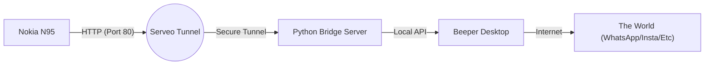

# 📱 Beeper N95: The Time-Traveling Chat Client

> **"All your modern chats. On a phone from 2007. Over 3G. Because why not?"**

 %20%7C%203.10%20(PC)-yellow.svg) 

**Beeper N95** is a native Python for S60 (PyS60) client that bridges the modern Beeper network (WhatsApp, iMessage, Instagram, etc.) to the legendary **Nokia N95** (and other S60v3 devices).

It solves the impossible: **talking to TLS 1.3 encrypted APIs using a device that only understands SSLv3.**

---

## 🚀 Features

* **Unified Inbox:** Access WhatsApp, Instagram, Signal, and iMessage contacts in a single native Symbian list.
* **3G/EDGE Optimized:** Extremely lightweight JSON payloads designed for unstable 15KB/s connections.
* **Unicode "Downgrading":** Automatically transliterates modern emojis and scripts (🙏 -> "mrhb") so they display safely on the N95's ASCII screen.
* **Infinite Session:** Keeps the connection alive using a custom Python middleware server.
* **Native UI:** Uses `appuifw` for that authentic, clicky S60 interface feel.

---

## 🏗️ Architecture

The N95 cannot speak to Beeper directly (incompatible encryption/protocols). We use a "Man-in-the-Middle" bridge on your PC.



1.  **The Phone** sends plain HTTP requests (`GET /get_messages`) over 3G or WiFi.
2.  **Serveo** (or Local WiFi) forwards traffic to your PC.
3.  **Server.py** translates requests and talks to the local Beeper API.
4.  **Beeper** handles the actual encryption and message delivery.

---

## 🔓 Prerequisites: Jailbreak & Python

Before you can run custom scripts, you must "Hack" (Jailbreak) your Symbian device to bypass certificate restrictions.

### 1. Hacking your S60 Device
You need to install `NortonHack` or `HelloOX` to allow unsigned applications.
* **Text Tutorial:** [The Norton Hack (S60v3/v5)](http://www.symbian-toys.com/faq.aspx#hack)
* **Video Tutorial:** [How to Hack Symbian S60v3 (YouTube)](https://www.youtube.com/watch?v=StartS60Hack) _(Search for "Norton Hack S60v3" if link is dead)_
* **Why?** Without this, you cannot install the Python runtime.

### 2. Installing Python for S60
You need the Python runtime and the Script Shell to execute the code.
1.  **Download Python + Script Shell:** [Phoneky Link (Python 2.5 + Shell)](https://mobile.phoneky.com/applications/?id=y0y18394&s=preview)
2.  Install the `.sis` file on your phone.
3.  Select "Install to Memory Card" if asked.

---

## ⚙️ Configuration (Critical Step)

You need to update a few variables in the code to link your phone, your PC, and your Beeper account.

### 1. Getting your Beeper Access Token
The bridge needs to talk to your Beeper Desktop app. You need your secret token.

* **Linux/macOS:** Run this command in your terminal to find it instantly:
    ```bash
    grep -oP '"access_token":\s*"\K[^"]+' ~/.config/beeper/config.json
    ```
* **Windows:** Open `%APPDATA%\Beeper\config.json` in Notepad and look for `access_token`.

### 2. Configuring `server.py` (The Bridge)
Open `server.py` on your PC and update these lines at the top:

```python
# The local URL where Beeper Desktop listens (Usually standard, rarely changes)
BEEPER_API_URL = "http://localhost:23373/v1"

# PASTE YOUR TOKEN HERE (Keep the quotes!)
ACCESS_TOKEN = "your_super_long_secret_token_starts_with_@"
```

### 3. Configuring `default.py` (The Phone)
Open `default.py` before sending it to the phone. You have two choices:

**Option A: Local WiFi (Home Testing)**
```python
SERVER_HOST = "192.168.1.XX"  # Your PC's local IP address
SERVER_PORT = 8080            # The port server.py is running on
```

**Option B: 3G/Data (Everywhere)**
*(See "Running Online" below to get this URL)*
```python
SERVER_HOST = "n95-aredrayy.serveousercontent.com" # Your custom Serveo URL
SERVER_PORT = 80
```

---

## 🛠️ Running the Bridge

### Part 1: Start the Python Server
On your Linux PC, run the bridge script. It must stay running.
```bash
python3 server.py
```

### Part 2: Create the Tunnel (For 3G Use)
If you want to use the phone away from home, you need a public URL. We use `autossh` + `serveo` to make a permanent link.

Run this in a separate terminal (or `screen` session):
```bash
# Replace 'n95-aredrayy' with a unique handle
autossh -M 0 -o "ServerAliveInterval 30" -o "ServerAliveCountMax 3" -R n95-aredrayy:80:localhost:8080 serveo.net
```
* **Note:** Keep this terminal open!
* **Copy the URL** (e.g., `n95-aredrayy.serveousercontent.com`) into your `default.py`.

### Part 3: Run on Phone
1.  Send `default.py` to your phone via Bluetooth/USB.
2.  Save it to `E:\Python\` (Memory Card).
3.  Open the **Python** app on the N95.
4.  `Options` -> `Run script` -> `default.py`.

---

## 📝 Code Snippets

**The "Unicode Cleaner" (Server-side):**
Because the N95 crashes on emojis, we scrub them clean:
```python
def clean_for_nokia(text):
    try:
        # Converts "Hello 👋" to "Hello "
        # Converts "Привет" to "Privet"
        return unidecode(text)
    except:
        return "?"
```

**The "Ghost Click" Fix (Client-side):**
Prevents the UI from switching chats until the slow 3G network confirms the server received the command.
```python
query = "/select_chat?id=" + urllib.quote(chat_id)
result = raw_http_get(query)

if result is not None:
    # Only switch screens if the network confirmed!
    show_chat_view(name)
```

---

## ❤️ Credits
* **Author:** [aredrayy](https://github.com/aredrayy)
* **Powered by:** [Beeper](https://beeper.com)
* **Tunneling:** [Serveo](https://serveo.net)
* **Device:** Nokia N95 8GB (The King of Smartphones)